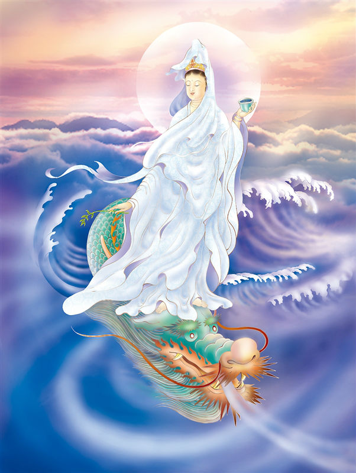

# 02-圣德龙头观世音

## 圣像

## 偈颂与训释

### 圣德龙头观世音 照现光华泽物种

### 开众蒙悋启慧光 普愿有情悟觉明

乘云中之龙，以龙譬喻观音之威德，是三十三身观音中的天龙身。

龙头观音摄化自在而示现之三十三观音之一。因驾乘龙头，故称龙头观音。相当于法华经普门品（大九·五七中）‘应以天龙、夜叉（中略）等身得度者，即皆现之而为说法’之观音化身。盖以龙为兽中之王，比喻观音之威神。一般流布之像皆为跏坐或站立于龙头上。

## 传奇

相传南海一带瘟神作怪，疫疾虐行，民不聊生且民风愚劣，观音菩萨决心到南海弘扬佛法，发下“常居南海愿”。海龙王第五子狻猊主动化为鳌龙驮乘观音赴南海救苦救难，并随行护法，为一方百姓讲经说法、大化天下，使这里的百姓安居乐业，过上了太平、幸福的生活。

