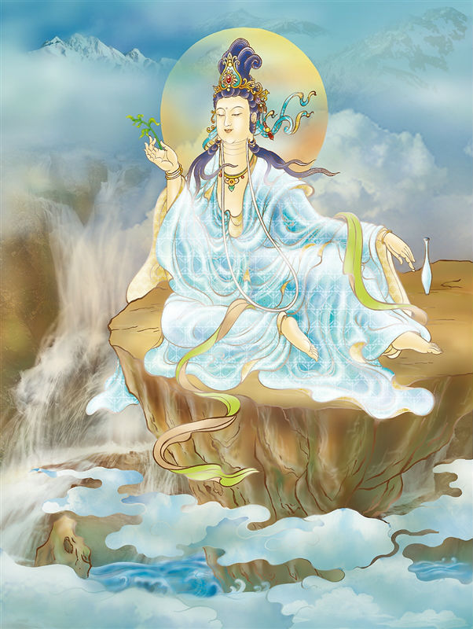

# 11-赴感德王观世音

## 圣像

## 偈颂与训释

### 赴感德王观世音 性净妙常香光严

### 慧启群萌观自在 梵王身相应现来

趺坐于岩上，右手持绿叶一枝。是三十三身观音中的梵王身。梵王为色界之王，因德性高超故名「德王」。

德王观音是三十三观音相之一。相当于法华经卷七普门品之（大九•五七上）“应以梵王身得度者，即现梵王身而为说法”之观音化身。盖梵王乃色界之主，其德殊胜，故称德王。世所流通之像为趺坐岩上，左手安置于脐前，右手持杨柳。

德王观音护佑：青云直上，仕途无量。

## 传奇

唐朝年间，淮西叛乱。朝庭派兵进剿，多次溃败。当地百姓身陷战乱，民不聊生。当时任朝廷小吏的裴度，到观音庙去烧香求签，观音菩萨即现出“梵王”之身，用灵签指点裴度平息叛乱，救百姓于水火之中。裴度得胜回朝后，宪宗皇帝封爵位为晋国公，勋位为上柱国。

裴度为感激观音菩萨大慈大悲的恩德，在淮西建了一座德王观音庙，保佑一方苍生。

