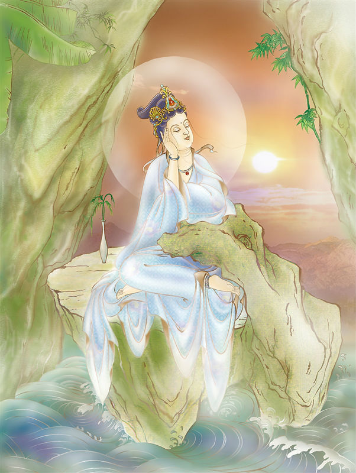

# 16-息灾延命观世音

## 圣像

## 偈颂与训释

### 息灾延命观世音 灭诸咒诅毒怨害

### 悬示留碍轮回种 紫金光照觉沧海

倚水边岩上，悠然观赏景物。此尊能消除咒诅及毒药，令众生延命长寿故称「延命」。

乘一叶莲瓣浮于水面漂行。是三十三身观音中的长者身。

延命观音护佑：百毒不侵，益寿延年。

延命观音祈求：一生不得怪病和不治之症，益寿延年。

## 传奇

延命观音，相传太仓民间流行一种怪疾，无医可治，民可不堪言。观音菩萨闻之，化成一位癞头和尚前来送药治病，刚开始百姓们都不相信，后来一位奄奄一息的老婆婆喝了癞头和尚用赤怪柳煮的药汤之后，怪病奇迹般地好了。老婆婆奔走相告，渐渐人们的怪疾痊愈了，正当人们要感谢癞头和尚之时，观世音菩萨显现真身，驾云而去。当地人们为感谢菩萨的恩德，便塑了一尊手持赤柽柳的观音宝像供奉起来。

