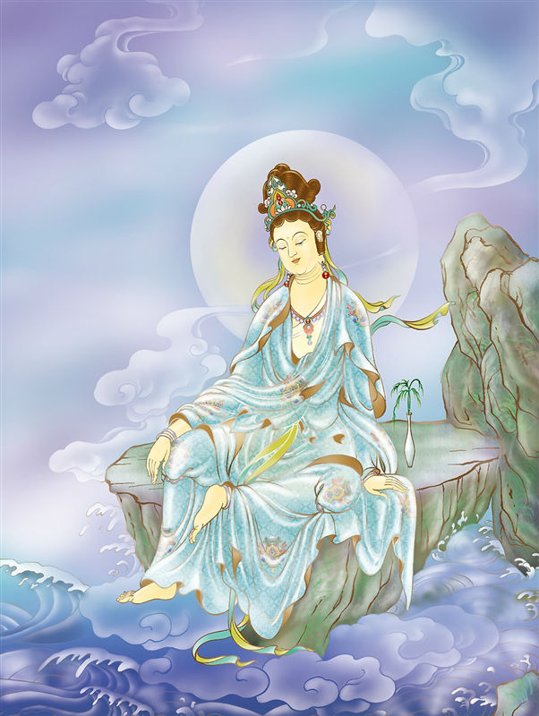

# 17-妙严众宝观世音

## 圣像

## 偈颂与训释

### 妙严众宝观世音 般若光宣示真际

### 寂静明心觉观照 长者身相度群迷

三十三观音之——众宝观音。趺坐地上，右手向地，左手放于膝上，袈裟上挂了很多珍宝。 表三十三身中之长者身。普门品说：“若有百千万亿众生，为求金银、琉璃、车渠、玛瑙、珊瑚、琥珀、珍珠等宝，入於大海，为其黑风吹其船舫，飘至罗刹鬼国，其中若有乃至一人，称念观世音菩萨名者，是诸人等，即得解脱罗刹之难”。以是因缘菩萨而现此身。

众宝观音护佑：仙人赐富、家业兴旺。

## 传奇

众宝观音：相传江北一带百姓勤劳本分，可惜不懂营生，所以都非常贫穷。有一个姓万的老汉，信奉佛法，家里供奉一尊观音菩萨像，此观音菩萨的身上挂满了很多宝贝，尊为众宝观音，以期菩萨保佑家道兴隆，一方昌盛。万家人每天从早到晚都虔诚的跪拜三次，其真挚之心感动菩萨。在菩萨的感应下，勤劳善良的万家人日子渐渐好了起来，家道也兴隆了，四方邻里纷纷效仿，形成一带习俗，江北家家户户都供奉起一尊众宝观音像，以求菩萨保佑，合家兴旺。

