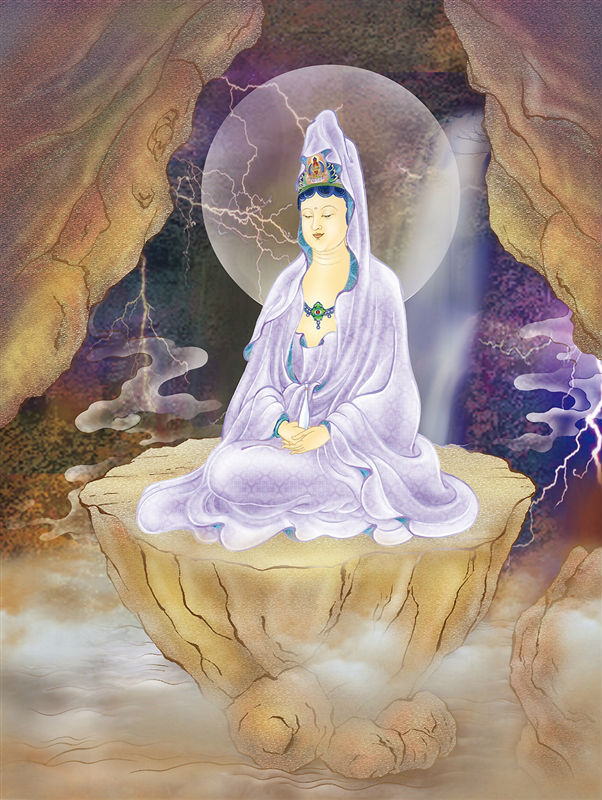

# 18-寂然岩户观世音

## 圣像

## 偈颂与训释

### 寂然岩户观世音 净眼普观周沙界

### 息灭三毒贪爱苦 蚖蛇蝮蝎出窟穴

端坐于岩窟内。《普门品》云：「蚖蛇及蝮蝎，气毒烟火燃，念彼观音力，寻声自回去。」

因这些毒虫多盘踞洞穴内，为免其出洞危害众生，观音因此坐镇岩窟中保护众生.

岩户观音，端坐于岩洞中，静思入定。

## 传奇

相传有个叫吴璋的孝子为了寻找母亲历尽千辛万苦。有一次，吴璋在途中被毒蛇咬伤，生命垂危，观音菩萨念其纯孝，便现出大慈宝相，将吴璋救醒，并使他们母子团聚。寂然岩户观世音净眼普观周沙界息灭三毒贪爱苦蚖蛇蝮蝎出窟穴岩户观音护佑：慈孝义全，德行满溢。

