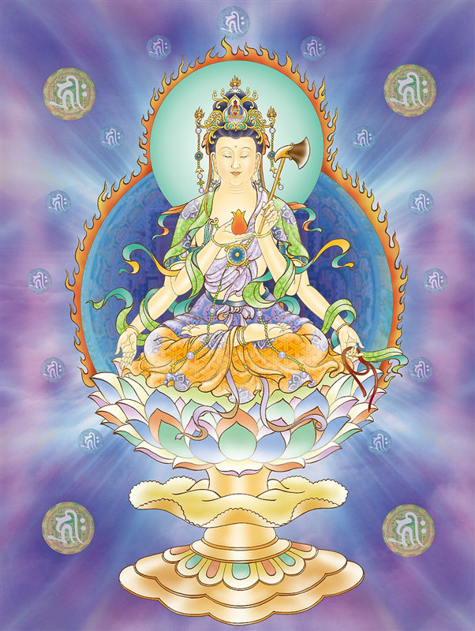

# 21-圆明叶衣观世音

## 圣像

## 偈颂与训释

### 圆明叶衣观世音 三千威仪妙慈容

### 神光内凝觉真澄 心光发宣帝释身

叶衣观音的缘起故事观音菩萨身穿千叶衣。古印度东南部就有一个夏帕拉族，以树叶为衣。婆罗门教女神亦有此形象。

相传观音菩萨身披一件八万四千功德衣，把众生所做的每一件善事都记录下来。

叶衣观音护佑：种善结缘，禅定笃成。

## 传奇

唐朝年间，长安有一对孤儿寡母，丈夫患肺痨去世了，母子二人无依无靠，以乞讨为生，城中开米粥铺的何氏夫妇收留了他们，把母子二人留在粥铺里帮忙，何氏夫妇还经常把每天余下来的粥救济那些没有饭吃的穷人们，百姓都说何氏夫妇是大好人，一定会好人有好报。

这一件件善事都被观音菩萨天耳所闻，天眼所见，于是菩萨化身一位达官贵人，赐何氏夫妇一件碧玉如意，保佑他们生意兴隆，无病无灾，修习祈祷，健康长寿。

