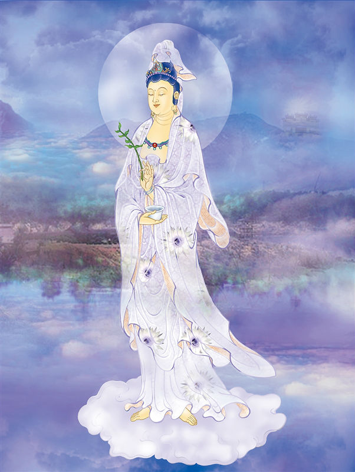

# 23-救苦多罗尊观音

## 圣像

## 偈颂与训释

### 救苦多罗观世音 与乐拔苦现剎尘

### 甘露遍洒十方界 悲应六趣普现身

直立乘云，合掌，手持青莲花。梵名「多罗」亦为救度，故又名「救度母观音」。

《普门品》云：「或值怨贼绕，各执刀加害，念彼观音力，咸即起慈心。」为此尊由来。

多罗尊观音，多罗意为“眼”、“瞳子”，作中年女像，为密宗所奉，又称多眼观音。象征观音菩萨能够观照世间一切，无所不察。

多罗尊观音护佑：儿孙满堂，全家欢聚。

多罗尊观音祈求：从军平安，全家团圆。

## 传奇

北宋末年，朝廷为抵抗金兵入侵，四处拉丁从军打仗，一位老阿婆，她的三个儿子都被抓去从军，留下儿媳和孙子相依为命，老阿婆坐在家门口天天盼着儿子早日归来，常期以泪洗面，由于思儿心切，眼睛逐失光明。观音菩萨怜其苦难，化作一个赤脚大夫为老阿婆治好了眼病，也保佑阿婆的儿子们从战场上平安归来。

