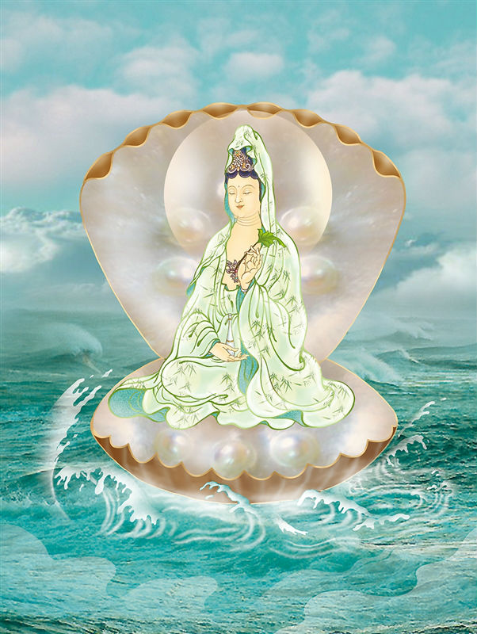

# 24-启悟蛤蜊观世音

## 圣像

## 偈颂与训释

### 启悟蛤蜊观世音, 慈诲爱语殷玄示.

### 无碍神变觉有情, 历劫熏修应微尘

观音菩萨无量化身，应机变现，救度与教化世人，化现蛤蜊是佛心慈悲的流露，提醒世人心存慈悲。

“路人无怙依，愿为彼引导，并作渡者舟，船筏与桥梁。求岛即成岛，欲灯化为灯， 我愿成彼仆……愿彼缘我者，究竟得解脱。觅床变作床，凡需仆从者，我愿成彼仆。”

## 传奇

相传唐文宗爱吃蛤蜊，沿海百姓月月进贡，弄得渔民苦不堪言。为完成进贡蛤蜊数量，常要冒着生命危险下海去捕捞蛤蜊，哪怕台风季节也要照常出海，许多渔船有去无回，致使家破人亡，百姓怨气冲天。观音菩萨知道人间苦难后，便隐身一只五彩大蛤蜊内，刀不能开，摔打不碎。宫廷御厨便拿此蛤蜊觐见文宗，文宗手托蛤蜊，蛤蜊竟慢慢自动打开，还有阵阵仙气飘出，定睛一看，里面竟是一尊珍珠观音宝像，见到蛤蜊内的观音宝像后，文宗大惊之余，忙下旨取消进贡蛤蜊，从此渔民又过上了安生乐业的生活。

