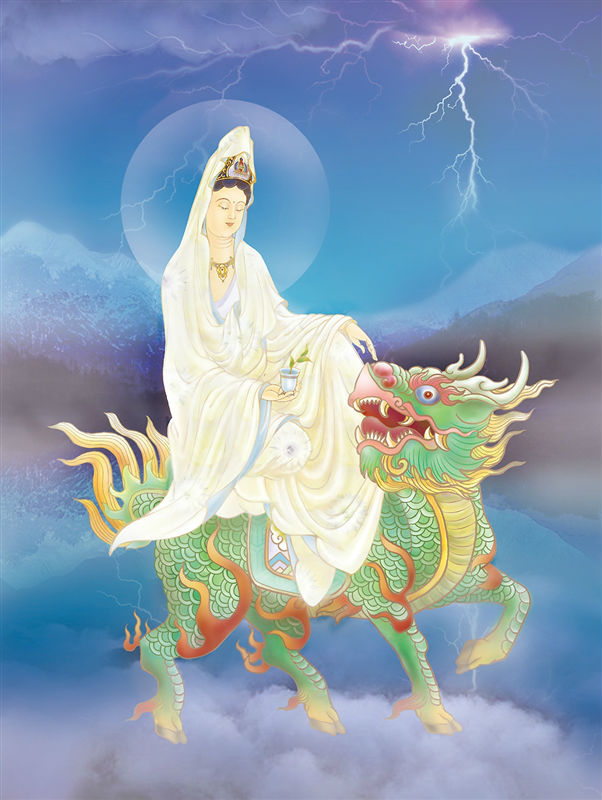

# 27-法性一如观世音

## 圣像

## 偈颂与训释

### 法性一如观世音 大悲如海性圆澄

### 慈音无遮开沉惑 直趣觉海不二门

观音坐在云中莲华座上立左膝，现征伏雷电之姿，为《普门品》云：「云雷鼓掣电，降雹澍大雨，念彼观音力，应时得消散。」之表征。

一如观音，其像坐于云中莲座上，立左膝，作乘云飞行之状。《三藏法术四》：“不二不已，名曰一如。”《教行信证四》：“法性即是真如，真如即使一如。”故一如观音，亦是修养达到最高境界之法相。

法华经普门品（大九•五八上）：‘云雷鼓掣电，降雹澍大雨；念彼观音力，应时得消散。形象为乘云飞行空中，右手持说法印，能制伏雷电等魔扰。

一如观音护佑：苦尽甘来，功成名就。

## 传奇

观音指点寓意不二为一，不异为如，是为一如，即真如之理。传说此观音保佑唐三藏西天取经，三藏经历饥渴、刀兵、牢狱、情爱、鬼怪九九八十一难之后仍信念不灭，誓取真经。诚心终感动菩萨，使之修性成佛，得成正果。

