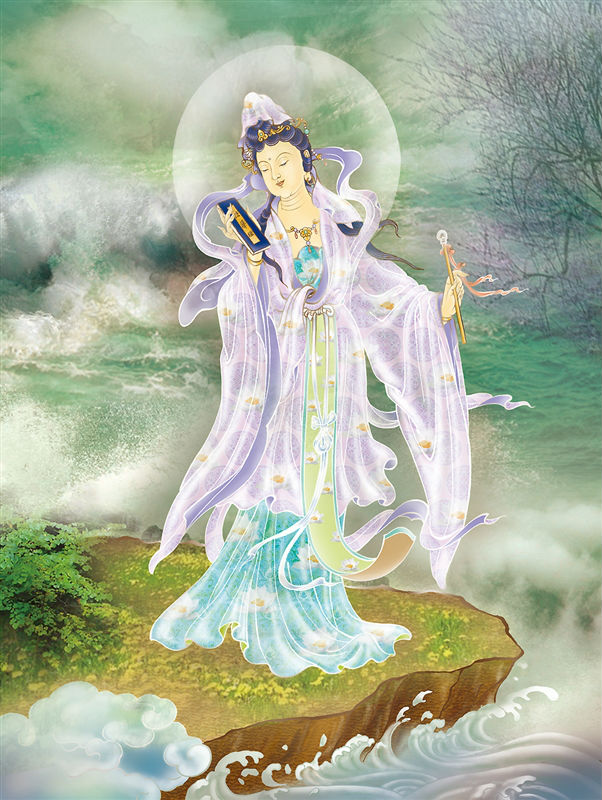

# 31-善德观音马郎妇

## 圣像

### 善德观音马郎妇 寂妙湛然净明露

### 梦幻泡影示出离 光照痴暗烦恼除

民间妇女形象。即在「鱼篮观音」故事中化身为少女嫁给马郎的观音。是三十三身观音中的妇女身。

丰姿窈窕鬓欹斜， 赚杀郎君念法华。

一把骨头挑去后， 不知明月落谁家。

## 偈颂与训释

## 传奇

马郎妇观音：《佛祖统纪》记载，唐朝宪宗时，陕西一带人民，善于骑射，未曾听闻三宝之名，观世音菩萨即化现为马郎之妇，以度化当地之居民，故称“马郎妇”。

