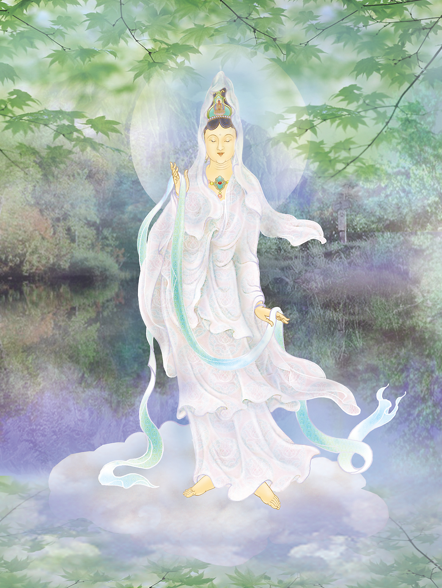

# 32-宝光普悲观世音

## 圣像

## 偈颂与训释

### 宝光普悲观世音 妙相慈颜净端严

### 圆明照彻三有海 大自在天圣威神

双手披衣，立于山岳之上。「普慈」意即普遍施给众生慈悲。是三十三身观音中的大自在天身。

普悲观音，为三十三观音之一。相当于法华经观世音菩萨普门品所载（大九•五七中）“应以大自在天身得度者，即现大自在天身而为说法”之观音化身。其形像为两手隐藏于法衣而向前下垂，立于山上。大自在天乃三界之最高神，以其威德殊胜，而配以观音平等普遍之慈悲，故称普悲观音。

普慈观音护佑：上任之初，开局顺利。

## 传奇

北宋年间，江南一高姓男子开了一家钱庄，生意兴旺，后因自己年事已高而把生意给儿子打理，自己则专心礼佛做善事。少东家因年少气盛和处事不当，与手下伙计关系不洽，相互间矛盾重重、狐疑猜忌，钱庄里天天吵吵闹闹、不得安宁，生意每况日下。观音菩萨感其老店主善事之举，化身为一伙计来钱庄上工，调和少东家与伙计间的关系。不久，钱庄少老板和伙计们言和意顺，精诚团结，钱庄生意一天比一天兴隆起来。

因这一观音化身为感应礼佛行善者事，护佑其上任之初，开局顺利，故被世人尊称为普慈观音。

