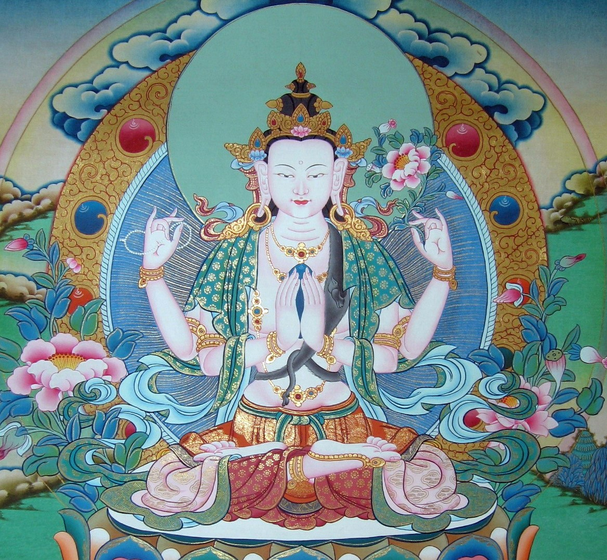

# 2.四臂观音

## 圣像

> 一头 表通达法性，
>
> 四臂 表四无量心，四臂另代表四种佛行（息增怀诛）。
>
> 身体白色 表自性清净无垢，不为烦恼、所知二障所障，清净无瑕的身语意
>
> 头戴五佛冠 表五智，代表五方智慧
>
> 发黑色 表不染，
>
> 五色天衣 表五方佛，
>
> 双跏趺 表不住生死，

> 手印 表不住涅盘。
>
> 又中央二手合掌于胸前，表智慧与方便合一双运，另右手持水晶念珠，表每拨一珠即救度一众生出脱轮回，左手持莲花，表清净无恼。
>
> 右后手 持水晶念珠代表救渡众生出离轮回
>
> 左后手 持白莲代表净化一切烦恼
>
> 左肩鹿皮 表慈悲纯正心
>
> 金刚坐 表稳固的禅定境界
>
> 以上六种装饰为六度万行成就；
>
> 坐月盘 上表慈悲方便法
>
> 其下莲花 象徵清净境界。

